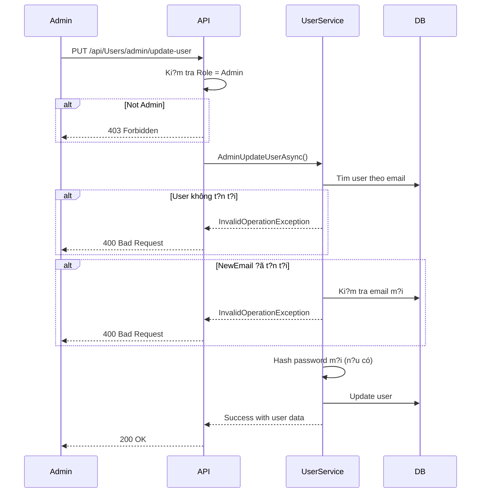

# ?? Admin Update User API - H??ng d?n s? d?ng

## ?? T?ng quan

API m?i cho phép **Admin** c?p nh?t thông tin c?a b?t k? user nào trong h? th?ng b?ng cách:
- ??i email
- ??i password (không c?n password c?)
- Ho?c c? hai

## ?? Quy?n truy c?p

**CH? ADMIN** m?i có quy?n s? d?ng API này.

## ?? API Endpoint

### **PUT** `/api/Users/admin/update-user`

#### Headers:
```
Authorization: Bearer {admin-jwt-token}
Content-Type: application/json
```

#### Request Body:

```json
{
  "email": "user@example.com",      // REQUIRED: Email hi?n t?i c?a user c?n update
  "newEmail": "newemail@example.com", // OPTIONAL: Email m?i (n?u mu?n ??i)
  "newPassword": "newpassword123"     // OPTIONAL: Password m?i (n?u mu?n ??i)
}
```

#### Validation Rules:

| Field | Required | Rules |
|-------|----------|-------|
| `email` | ? Yes | Ph?i là email h?p l? |
| `newEmail` | ? No | Ph?i là email h?p l?, ch?a t?n t?i trong h? th?ng |
| `newPassword` | ? No | T?i thi?u 6 ký t? |

**L?u ý:** Ph?i cung c?p ít nh?t `newEmail` HO?C `newPassword` (ho?c c? hai).

## ?? Examples

### Example 1: Ch? ??i email

**Request:**
```json
{
  "email": "olduser@example.com",
  "newEmail": "newuser@example.com"
}
```

**Response (200 OK):**
```json
{
  "message": "User updated successfully!",
  "user": {
    "id": "123e4567-e89b-12d3-a456-426614174000",
    "username": "JohnDoe",
    "email": "newuser@example.com",
    "role": "User"
  }
}
```

### Example 2: Ch? ??i password

**Request:**
```json
{
  "email": "user@example.com",
  "newPassword": "NewSecurePassword123"
}
```

**Response (200 OK):**
```json
{
  "message": "User updated successfully!",
  "user": {
    "id": "123e4567-e89b-12d3-a456-426614174000",
    "username": "JohnDoe",
    "email": "user@example.com",
    "role": "User"
  }
}
```

### Example 3: ??i c? email và password

**Request:**
```json
{
  "email": "olduser@example.com",
  "newEmail": "newuser@example.com",
  "newPassword": "NewSecurePassword123"
}
```

**Response (200 OK):**
```json
{
  "message": "User updated successfully!",
  "user": {
    "id": "123e4567-e89b-12d3-a456-426614174000",
    "username": "JohnDoe",
    "email": "newuser@example.com",
    "role": "User"
  }
}
```

## ? Error Responses

### 1. Không ph?i admin (403 Forbidden)
```json
{
  "type": "https://tools.ietf.org/html/rfc7235#section-3.1",
  "title": "Forbidden",
  "status": 403
}
```

### 2. User không t?n t?i (400 Bad Request)
```json
{
  "message": "User with this email does not exist."
}
```

### 3. Email m?i ?ã ???c s? d?ng (400 Bad Request)
```json
{
  "message": "New email is already in use by another user."
}
```

### 4. Token không h?p l? (401 Unauthorized)
```json
{
  "type": "https://tools.ietf.org/html/rfc7235#section-3.1",
  "title": "Unauthorized",
  "status": 401
}
```

## ?? Test v?i Postman/cURL

### Using cURL:

```bash
curl -X PUT "https://localhost:7xxx/api/Users/admin/update-user" \
  -H "Authorization: Bearer YOUR_ADMIN_TOKEN" \
  -H "Content-Type: application/json" \
  -d '{
    "email": "user@example.com",
    "newEmail": "updated@example.com",
    "newPassword": "newpassword123"
  }'
```

### Using PowerShell:

```powershell
$headers = @{
    "Authorization" = "Bearer YOUR_ADMIN_TOKEN"
    "Content-Type" = "application/json"
}

$body = @{
    email = "user@example.com"
    newEmail = "updated@example.com"
    newPassword = "newpassword123"
} | ConvertTo-Json

Invoke-RestMethod -Uri "https://localhost:7xxx/api/Users/admin/update-user" `
    -Method PUT `
    -Headers $headers `
    -Body $body
```

## ?? Flow ho?t ??ng



## ?? Security Features

1. **Role-based Access Control**: Ch? admin m?i có quy?n
2. **Email Validation**: Ki?m tra ??nh d?ng email
3. **Duplicate Check**: Không cho phép email trùng l?p
4. **Password Hashing**: T? ??ng hash password v?i BCrypt
5. **Minimum Password Length**: Password t?i thi?u 6 ký t?

## ?? Use Cases

### Case 1: User quên email và password
Admin có th? reset c? hai ?? user có th? ??ng nh?p l?i.

### Case 2: User b? hack
Admin có th? nhanh chóng ??i password và email ?? b?o v? tài kho?n.

### Case 3: Sai email khi ??ng ký
Admin có th? s?a email cho user mà không c?n user ph?i ??ng ký l?i.

### Case 4: Yêu c?u h? tr?
User liên h? support ?? ??i thông tin, admin có th? x? lý nhanh chóng.

## ?? Important Notes

1. **Password không c?n old password**: Khác v?i user ??i password thông th??ng, admin có th? ??i tr?c ti?p.
2. **Email ph?i unique**: H? th?ng t? ??ng ki?m tra email m?i không b? trùng.
3. **Case sensitivity**: Email không phân bi?t hoa/th??ng trong database.
4. **Audit log**: Nên thêm logging ?? theo dõi các thay ??i c?a admin.

## ??? Testing Checklist

- [ ] Test v?i admin token h?p l?
- [ ] Test v?i user token (ph?i b? 403)
- [ ] Test v?i email không t?n t?i
- [ ] Test ??i ch? email
- [ ] Test ??i ch? password
- [ ] Test ??i c? email và password
- [ ] Test v?i email m?i ?ã t?n t?i
- [ ] Test v?i email không h?p l?
- [ ] Test v?i password < 6 ký t?
- [ ] Test không có token (401)

## ?? Related APIs

| API | Method | Endpoint | Role |
|-----|--------|----------|------|
| Get All Users | GET | `/api/Users` | Admin |
| Delete User | DELETE | `/api/Users/{id}` | Admin |
| Update User Info | PUT | `/api/Users/admin/update-user` | Admin |
| Change Own Password | PUT | `/api/Users/change-password` | User |
| Update Own Profile | PUT | `/api/Users/profile` | User |

---

**Created:** 2024-11-26  
**Version:** 1.0  
**Author:** FlashcardLearning API Team
